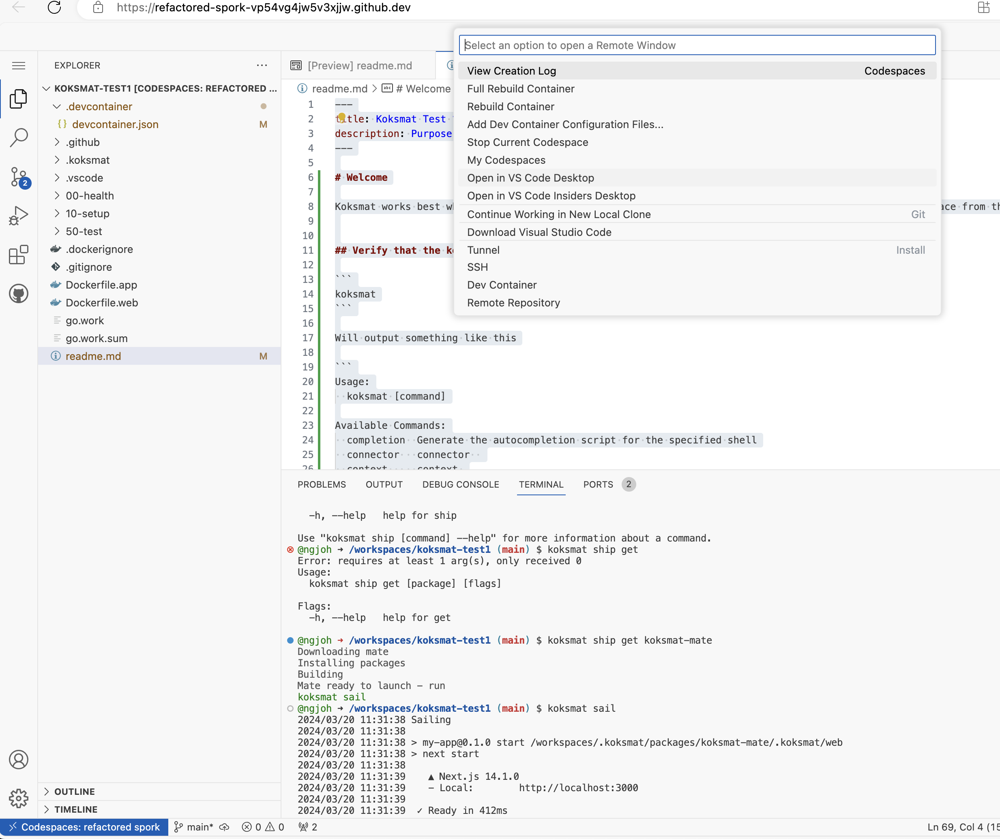

# Welcome

The first time you will have to wait a little while for the post installation process to complete.

```
✔ Finishing up...
⠼ Running postCreateCommand...
  › go install github.com/koksmat-com/koksmat@v2.0.0.8
```

## Verify that the koksmat CLI is installed

```
koksmat
```

Will output something like this

```
Usage:
  koksmat [command]

Available Commands:
  completion  Generate the autocompletion script for the specified shell
  connector   connector
  context     context
  help        Help about any command
  kitchen     kitchen
  sail        Auto pilot mode
  ship        Shipping handling
  sign        Digital signing

Flags:
  -h, --help     help for koksmat
  -t, --toggle   Help message for toggle

Use "koksmat [command] --help" for more information about a command.
```

Koksmat works best when running using a desktop VS Code version, so start by Connecting to this Code Space from there



## Install the `Mate`

```
koksmat ship get koksmat-mate
```

Outputs - Will take 10 to 60 seconds depending on your machines capacity

```
Downloading mate
Installing packages
Building
Mate ready to launch - run
koksmat sail
```

Run the following command

```
koksmat sail
```

A web server is started on your local machine, that gives you a UI to use

```
2024/03/20 11:31:38 Sailing
2024/03/20 11:31:38
2024/03/20 11:31:38 > my-app@0.1.0 start /workspaces/.koksmat/packages/koksmat-mate/.koksmat/web
2024/03/20 11:31:38 > next start
2024/03/20 11:31:38
2024/03/20 11:31:39    ▲ Next.js 14.1.0
2024/03/20 11:31:39    - Local:        http://localhost:3000
2024/03/20 11:31:39
2024/03/20 11:31:39  ✓ Ready in 412ms
```
